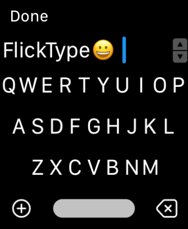

[](https://travis-ci.com/FlickType/FlickTypeKit) 

# FlickTypeKit 🚀

["Apple Watch App of the Year"](https://appadvice.com/post/appadvices-top-10-apple-watch-apps-2018/764638) - AppAdvice

["Makes Typing a Breeze"](https://www.forbes.com/sites/davidphelan/2019/03/02/apple-watch-flicktype-gesture-keyboard-app-makes-typing-a-breeze-is-it-any-good/) - Forbes

Try out the latest version of the keyboard in the [FlickType Notes](https://testflight.apple.com/join/4DvMpMl2) app.



## Integration
- Copy the `FlickTypeKit` directory from `FlickTypeKit Sample (Swift)` into your project folder.

### In your watch extension target: 
- Under **General** > **Frameworks, Libraries, and Embedded Content**: click the **+** button, then `Add Other...`/`Add Files...` and add `FlickTypeKit.xcframework`.

### In you watch app target:
  - Under **Build Phases** > **Copy Bundle Resources**, add the `App Resources/FlickType.storyboard` file.
  - Add a "Storyboard Reference" to your main watch storyboard file and set its "Referenced ID" to `FlickType`.

That's it!

_**Note**: If your app is in Objective-C, make sure [Always Embed Swift Standard Libraries](https://indiestack.com/2017/03/implicit-swift-dependencies/) is set to YES for the watch extension target. You can also watch this [integration tutorial](https://www.youtube.com/watch?v=f7TkCE7gaDc)_

## Usage
Simply `import FlickType` and then modify your existing `presentTextInputController()` calls to include the additional `flickTypeMode` argument:

```
import FlickTypeKit

presentTextInputController(withSuggestions: nil, allowedInputMode: .allowEmoji, flickTypeMode: .ask) { items in
  if let text = items?.first as? String {
    print("User typed text: \(text)")
  }
}
```

### Configuration
 - `FlickType.Mode.ask` will offer a choice between FlickType and the standard input methods _(recommended)_.
 - `FlickType.Mode.always` will _only_ offer FlickType, skipping the input method selection.
 - `FlickType.Mode.off` will _only_ offer the standard input methods.

### Editing
The optional `startingText` argument can be used to support editing of existing text. Editing is currently only supported with FlickType; the value of `startingText` is ignored when using one of the standard input methods.

### Running on device
Once you get things working in the Simulator, email us at [sdk@flicktype.com](mailto:sdk@flicktype.com) with the bundle ID of your watch _extension_ target, so we can whitelist it for use on real devices.

### Help & support
See the included sample app, [email](mailto:sdk@flicktype.com) us, or join us on [Discord](https://discord.gg/MFyvmhe).

### Terms & conditions
See our [license page](LICENSE.md).

## Coming soon
- Improved number & symbol entry
- More languages
- Much more…

# ⌚️😎
